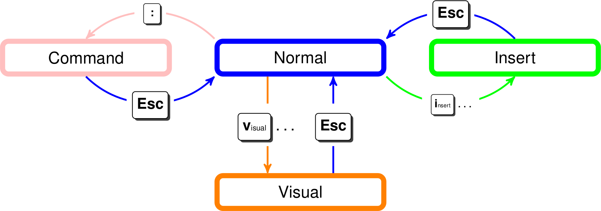

# VimTutorials 

## To preface this document there many resources for learning Vim.
   Some of these resources may prove to be more useful to you than 
   this document. That said, exercises provided here are constructed 
   in such a way each build on each other. Consider this resource as a supplement 
   to the links given below. 

  - [Learn vim For the Last Time: A Tutorial and Primer](https://danielmiessler.com/study/vim/)
  - [VIM Cheatsheet](http://www.fprintf.net/vimCheatSheet.html)
  - [ Vi Keybindings](http://hea-www.harvard.edu/~fine/Tech/vi.html)
  - [OpenVim Tutor](https://www.openvim.com)
  - [Vim Tutorial for Beginners: vimtutor](https://www.systutorials.com/vim-tutorial-beginners-vimtutor/)
  - [Groking Vim](https://stackoverflow.com/questions/1218390/what-is-your-most-productive-shortcut-with-vim/1220118#1220118)
  
 Last but not least is vimtutor which is available in console. Which provides an excellent starting point for the fundamentals. 
 '$ vimtutor ' 
## Exercises
  Do the excercises below in the following order:
  - 

## 0000 Getting Started! 
  ### Curling this repository 
   #### Syntax:
     
     '$ curl -o [file_name] [URL ..]  '
   #### Instance: 
      'curl -o VimTutorials.gz https://github.com/esch3r/VimTutorials'

  ### Git Clone  
   ####  Another way to yank these files to view them in console is with the git clone command. 
    '$ git clone https://github.com/esch3r/VimTutorials'
  

## 0001 Lesson 1.  Entering/Exiting Vim  

1.  Open a file with **Vim FirstLesson.txt** 
2.  Once in vim hit **i** to enter insert mode. Write some random 
     sentences for practice later. When finished hit the **esc** key.
3.  Repeat this text selection, as many times as the task requires: 
    - Using the arrow keys move the cursor about the screen. 
    - Enter visual mode by pressing **v**
    - Highlight text using the cursor in visual mode  using the arrow keys. 
    - Press **y** to *yank* or otherwise known as copy the selected text.
    - Move using arrow keys again to intended location in the text to paste
    - Press **p** to paste selected text in question. 
4.  Upon exiting and saving your progress preform following keystokes listed below     in the table to write or discard file edits:

| Keystroke   | Function  | 
|----------|-------------:|
| :w or w *file*|   save changes to buffer or safe file to new file  | 
|  ZZ or :wq |  Save changes and quit | 
|  :q! | quit without saving | 

      

## 0010 Lesson 2. Modes within vim 

 
   ### Insert:  
   - Modify the file inserting new text.
      
   ### Visual: 
   - Visually select text by moving cursor over it,
         then operate over the text thats selected. 
         
   ### Normal:
   - Default mode 
   - Allows quick mauevers through the text. 
   - Switching between other modes.
       
   ### Select: 

## 0011 Lesson 3. Navigating text 

| Keystroke   | Function  | 
|----------|-------------:|
|   h  |   Move cursor left | 
|  l/spacebar |  Move cursor right | 
|  k/Ctrl+p |  Move cursor up  | 
|  J/Ctrl+n |  Move cursor down| 
|  Ctrl+f   |  Scroll forward one page| 
|  Ctrl+b   |  Scroll forward one page| 
|  Ctrl+d  |  Scroll down one half of a page| 

## 0100 Lesson 4. Window Pains

| Keystroke   | Function  | 
|----------|-------------:|
|  hsp|   Horizontally split window | 
|  vsp |  vertically split window| 
|  Shift+W | Traverse between windows  | 

## 0101 Lesson 5. Searching 
| keystroke  |  Function |
|------------| -----------:|
|  /PaTTeRn |  Search forward for PaTTeRn |
|  ?PaTTeRn |  Search backward for PaTTeRn |
|   n       |  Repeat foward search        |
|   N       |  Repeat backward search      |

## 0110 Lesson 6. Subsitution 

## 1001 Lesson 9. Plugins 

 
